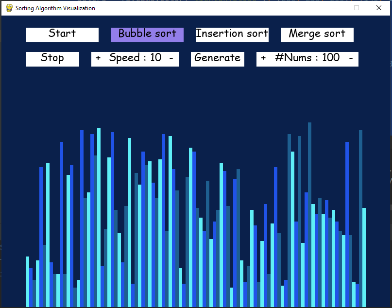

# Sorting visualizer
### I selected and built a Sorting visualizer to visualize and understand the most common sorting algorithms. As of now, I built only 3 sorting algorithms as :

*   Bubble sort
*   Insertion sort
*    Merge sort

### About Project :
* This project is built using Python (Pygame). This project sorting visualizer is a very simple UI and it allows the users to select the sort algorithm, select the array size, and speed of the visualization.

* 

* 
